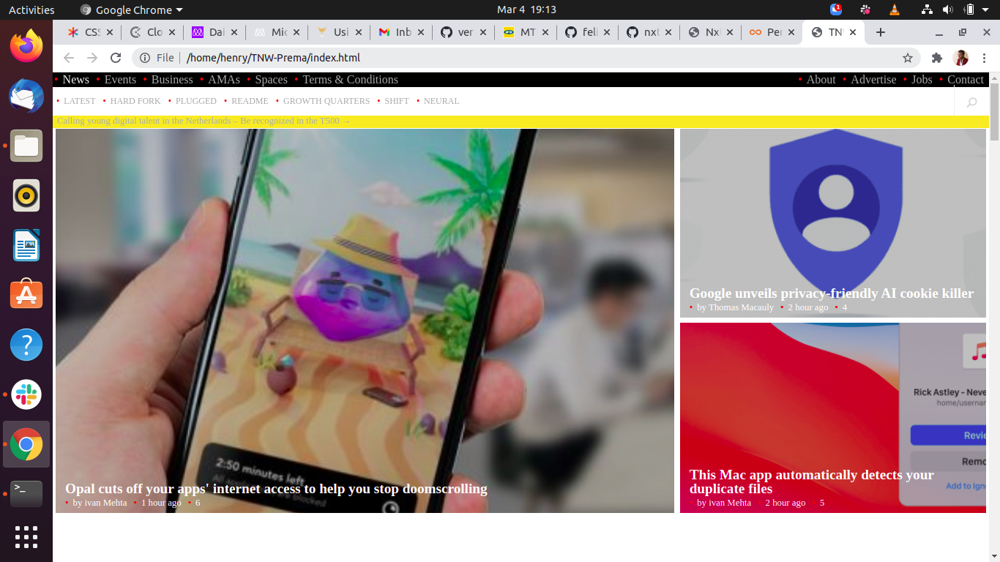

# The Next Web Clone-Milestone1

> The Next Web (TNW).

## Built With

- HTML
- CSS
## Live Demo

[The Next Web](https://verissimohenry.github.io/TNW-Prema/)

## Getting Started

1.CLone The Repository locally on your Computer.

2.Open The Directory,where you cloned the Repository.

3.open the "index.html" file.

## Author

👤 **Author1**
# Verissmo Henry
- GitHub: [@githubhandle](https://github.com/verissimohenry)
- LinkedIn: [LinkedIn](https://www.linkedin.com/in/henry-verissimo-618906167/)

## 🤝 Contributing

Contributions, issues, and feature requests are welcome!

Feel free to check the [issues page](https://github.com/verissimohenry/TNW-Prema/pull/1#partial-pull-merging).

## Show your support

Give a ⭐️ if you like this project!

## Acknowledgments

- The Next Web

## 📝 License

This project is [MIT](https://opensource.org/licenses/MIT) licensed.
